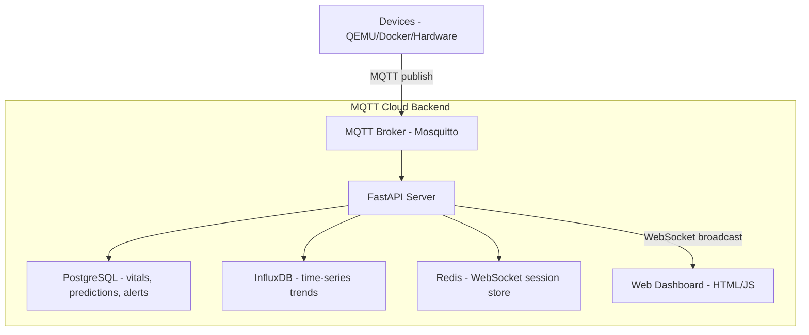

# MedTech Telemetry Cloud

Open-source cloud backend for real-time medical IoT device data collection, storage, and visualization.

## Architecture



## Features

- **MQTT Ingestion** — Receives vitals and predictions from devices via Mosquitto
- **Time-Series Storage** — InfluxDB for trend queries
- **Relational Storage** — PostgreSQL for vitals, predictions, and alerts
- **REST API** — FastAPI with full OpenAPI docs at `/docs`
- **Real-Time Streaming** — WebSocket endpoint pushes live updates to the dashboard
- **Alert Engine** — Automatic risk threshold alerts stored in PostgreSQL
- **Web Dashboard** — Live visualization served by Nginx
- **Docker Compose** — Single-command startup
- **Zero Cost** — All open-source components, fully self-hosted

## Technology Stack

| Component | Technology | Purpose |
|-----------|-----------|---------|
| Message Broker | Mosquitto (MQTT) | Device data ingestion |
| Time-Series DB | InfluxDB 2.7 | Vital-sign trend queries |
| Relational DB | PostgreSQL 15 | Vitals, predictions, alerts |
| Cache / Session | Redis 7 | WebSocket session store |
| API Server | Python 3.10 / FastAPI | REST + WebSocket endpoints |
| Frontend | HTML / CSS / JavaScript | Web dashboard |
| Orchestration | Docker Compose | Local deployment |

## Quick Start

```bash
# Build and start all services
docker compose up --build

# Run in the background
docker compose up -d --build

# Services available at:
# MQTT (TCP):   localhost:1883
# MQTT (WS):    localhost:9001
# InfluxDB:     http://localhost:8086
# PostgreSQL:   localhost:5432
# Redis:        localhost:6379
# API:          http://localhost:8000
# API Docs:     http://localhost:8000/docs
# Dashboard:    http://localhost:3000
```

## MQTT Topics

| Topic | Direction | Description |
|-------|-----------|-------------|
| `medtech/vitals/latest` | Device → Cloud | Current vital readings |
| `medtech/predictions/sepsis` | Device → Cloud | Sepsis risk predictions |

### Example Payload — Vitals

```json
{
  "timestamp": 1712973600000,
  "hr": 92,
  "bp_sys": 135,
  "bp_dia": 85,
  "o2_sat": 98,
  "temperature": 37.2,
  "quality": 95,
  "source": "device-001"
}
```

### Example Payload — Predictions

```json
{
  "timestamp": 1712973600000,
  "risk_score": 45,
  "risk_level": "LOW",
  "confidence": 0.75,
  "model_latency_ms": 87.5
}
```

## REST API Endpoints

```
GET  /health                              - Service health check

GET  /api/v1/vitals                       - Recent vitals (?limit=10&hours=24)
GET  /api/v1/vitals/latest                - Most recent vital reading
GET  /api/v1/vitals/{id}                  - Vital by ID
POST /api/v1/vitals                       - Ingest vital (non-MQTT path)

GET  /api/v1/predictions                  - Recent predictions (?limit=10&hours=24)
GET  /api/v1/predictions/latest           - Most recent prediction
POST /api/v1/predictions                  - Ingest prediction (non-MQTT path)

GET  /api/v1/analytics/summary            - Aggregated stats (?hours=24)
GET  /api/v1/analytics/trends             - Time-series trend (?metric=hr&hours=24)
                                            metric: hr | bp_sys | bp_dia | o2_sat | temperature

GET  /api/v1/alerts                       - List alerts (?limit=20&acknowledged=false)
POST /api/v1/alerts/{id}/acknowledge      - Acknowledge an alert

WS   /api/v1/stream                       - Real-time WebSocket stream
```

Full interactive docs: **http://localhost:8000/docs**

## Web Dashboard

```
Visit: http://localhost:3000

Displays:
- Real-time vital readings (updates via WebSocket)
- Latest sepsis risk prediction
- Historical trend charts
- Summary statistics
```

### Live Changing Demo Data

Use the bundled simulator publisher to continuously send changing vitals.

```bash
# Continuous stream (Ctrl+C to stop)
bash scripts/publish_live_vitals.sh

# Example: send 30 messages, one every second
COUNT=30 INTERVAL=1 SOURCE=demo bash scripts/publish_live_vitals.sh
```

Optional environment variables:

- `HOST` (default: `localhost`)
- `PORT` (default: `1883`)
- `TOPIC` (default: `medtech/vitals/latest`)
- `INTERVAL` in seconds (default: `1`)
- `SOURCE` (default: `live-sim`)
- `COUNT` (default: `0`, meaning continuous)

## Integration with Devices

### Publish from QEMU / any host

```bash
# Publish a vital reading
mosquitto_pub -h <cloud-ip> -p 1883 \
  -t medtech/vitals/latest \
  -m '{"timestamp":1712973600000,"hr":92,"bp_sys":135,"bp_dia":85,"o2_sat":98,"temperature":37.2,"quality":95,"source":"device-001"}'

# Publish a prediction
mosquitto_pub -h <cloud-ip> -p 1883 \
  -t medtech/predictions/sepsis \
  -m '{"timestamp":1712973600000,"risk_score":45,"risk_level":"LOW","confidence":0.75,"model_latency_ms":87.5}'
```

### From another Docker Compose project

Set the MQTT broker host to the cloud IP and publish to the topics above; vitals and predictions sync automatically.

## Testing

Tests are organised into three levels. The test runner is `pytest`; async tests use `pytest-asyncio`.

### Unit Tests (no external services required)

```bash
# Run all unit tests
docker compose exec api pytest tests/unit -v

# Run a specific test module
docker compose exec api pytest tests/unit/test_api_endpoints.py -v
docker compose exec api pytest tests/unit/test_alert_engine.py -v
docker compose exec api pytest tests/unit/test_mqtt_payloads.py -v
docker compose exec api pytest tests/unit/test_mqtt_client.py -v
docker compose exec api pytest tests/unit/test_database.py -v

# Run with coverage
docker compose exec api pytest tests/unit --cov=api --cov-report=term-missing -v
```

### Integration Tests (require running services)

Start the full stack first (`docker compose up -d`), then:

```bash
# Run all integration tests
docker compose exec api pytest tests/integration -v

# Individual suites
docker compose exec api pytest tests/integration/test_mqtt_to_api.py -v
docker compose exec api pytest tests/integration/test_databases_sync.py -v
docker compose exec api pytest tests/integration/test_websocket_stream.py -v
```

Override service hostnames if running tests from outside the container:

```bash
TEST_MQTT_BROKER=localhost \
TEST_POSTGRES_HOST=localhost \
TEST_INFLUXDB_URL=http://localhost:8086 \
pytest tests/integration -v
```

### Acceptance / End-to-End Tests

```bash
docker compose exec api pytest tests/acceptance -v
```

### Run All Tests

```bash
docker compose exec api pytest -v
```

## Monitoring

```bash
# Tail API logs
docker compose logs -f api

# Tail all service logs
docker compose logs -f

# Watch live MQTT traffic
docker exec telemetry-mqtt mosquitto_sub -t "medtech/#" -v

# Query PostgreSQL
docker exec telemetry-postgres \
  psql -U medtech -d telemetry -c "SELECT * FROM vitals ORDER BY id DESC LIMIT 5;"

# Query InfluxDB health
curl http://localhost:8086/health

# Check Redis
docker exec telemetry-redis redis-cli ping

# Check all container status
docker compose ps
```

## Verify End-to-End

```bash
# 1. Start services
docker compose up -d --build

# 2. Wait for healthy status
docker compose ps

# 3. Health check
curl http://localhost:8000/health

# 4. Push a test vital via MQTT
mosquitto_pub -h localhost -p 1883 \
  -t medtech/vitals/latest \
  -m '{"timestamp":1712973600000,"hr":72,"bp_sys":118,"bp_dia":76,"o2_sat":99,"temperature":36.8,"quality":97,"source":"test"}'

# 5. Confirm it was stored
curl http://localhost:8000/api/v1/vitals/latest

# 6. Push a test prediction
mosquitto_pub -h localhost -p 1883 \
  -t medtech/predictions/sepsis \
  -m '{"timestamp":1712973600001,"risk_score":20,"risk_level":"LOW","confidence":0.90,"model_latency_ms":55}'

# 7. Confirm prediction and check analytics
curl http://localhost:8000/api/v1/predictions/latest
curl "http://localhost:8000/api/v1/analytics/summary?hours=1"

# 8. View the dashboard
curl http://localhost:3000

# 9. Stop services
docker compose down
```

## Troubleshooting

### Dashboard shows static / no live updates

The WebSocket pipeline (MQTT → API → WebSocket → browser) is healthy but the broker must receive messages.

1. Confirm the stack is up: `docker compose ps` — all containers should be `healthy`.
2. Verify the API is subscribing: `docker compose logs api | grep "MQTT.*subscrib"`.
3. Send a test message via the simulator and watch API logs:
   ```bash
   COUNT=3 INTERVAL=1 bash scripts/publish_live_vitals.sh
   docker compose logs api --since=10s | grep "MQTT message received"
   ```
4. If API logs show no messages, check which process owns port 1883 (see WSL section below).

---

### WSL: host `mosquitto` conflicts with Docker broker on port 1883

**Root cause.** When a `mosquitto` service is running on the WSL host it binds `127.0.0.1:1883`. Any `mosquitto_pub` call to `localhost:1883` then hits the *host* broker, not the containerised one. Messages land on the wrong broker and the API subscriber never fires — the dashboard appears frozen.

**Diagnosis:**

```bash
# Does a host mosquitto own 1883?
netstat -tlnp | grep 1883
# "127.0.0.1:1883 LISTEN" with a non-Docker PID confirms the conflict.

# What port is Docker actually exposing?
docker compose port mqtt 1883
# If this shows 0.0.0.0:1883 but the host also owns 1883, Docker's NAT
# rule still maps 127.0.0.1:1883 to the host service first.
```

**Fix — stop the host service (recommended for development):**

```bash
sudo systemctl stop mosquitto
sudo systemctl disable mosquitto   # prevent restart on next WSL boot
```

**Alternative fix — remap the Docker host port so there is no clash:**

In `docker-compose.yml`, change the mqtt port mapping:
```yaml
ports:
  - "1884:1883"   # host 1884 → container 1883
  - "9001:9001"
```
Then publish to port 1884 from the WSL host:
```bash
PORT=1884 bash scripts/publish_live_vitals.sh
```

**Verify the fix (whichever approach you chose):**

```bash
mosquitto_pub -h localhost -p 1883 -t medtech/vitals/latest \
  -m '{"hr":80,"source":"fix-check"}' && sleep 2 && \
docker compose logs api --since=5s | grep "MQTT message received"
```
If the API log line appears, the conflict is resolved.

---

### MQTT messages connect to broker but API logs nothing

This means the message reached the Mosquitto container but the API client did not receive it. Possible causes:

- Topic mismatch — check the subscriber topic: `docker compose logs api | grep "subscrib"`. Default is `medtech/vitals/latest` and `medtech/predictions/sepsis`.
- API container restarted after the MQTT client connected — `docker compose restart api` and retry.
- ACL rules blocking the topic — review `config/mosquitto-medtech.conf`.

---

### 403 on dashboard (`http://localhost:3000`)

Nginx is serving from the wrong path or the container is not running.

```bash
docker compose logs dashboard
# Look for "403 Forbidden" source path, then fix nginx.conf static root.
```